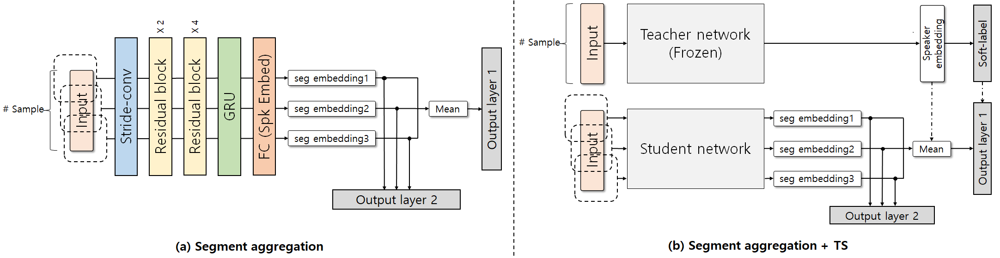

# Overview
This code is for ["Segment Aggregation for short utterances speaker verification using raw waveforms".]( https://arxiv.org/pdf/2005.03329.pdf ) 
This paper proposed a method that compensates for the performance degradation of speaker verification, referred to as "segment aggregation".
The proposed method adopts an ensemble-based design to improve the stability and accuracy of speaker verification systems.





**We referenced the baseline system RawNet code at [here]( https://github.com/Jungjee/RawNet )
##### Email kimho1wq@naver.com

# Datasets
We used VoxCeleb2 dataset for training and VoxCeleb1 original evaluation set for test. 
Input two dataset in DB directory for training and test.

# Training
```
1. ./train_run.sh
2. python train_RawNet_SA_TS_rand.py -name rawnet_SA_TS_rand_1s_3s
```

# Test
```
Go into test directory
1. ./test_run.sh
2. python test_pre_trained_model.py -pretrained_name best_rawnet_SA_TS_1s_3s.pt
```

# BibTex

This reposity provides the code for reproducing below papers. 
```
@article{seung2020cagging,
  title={Segment Aggregation for short utterances speaker verification using raw waveforms},
  author={Kim, Seung-bin and Jung, Jee-weon and Shim, Hye-jin and Kim, Ju-ho and Yu, Ha-Jin},
  journal={arXiv preprint arXiv:2005.03329},
  year={2020}
}
```

# Log
- 2020.05.08. : Init
